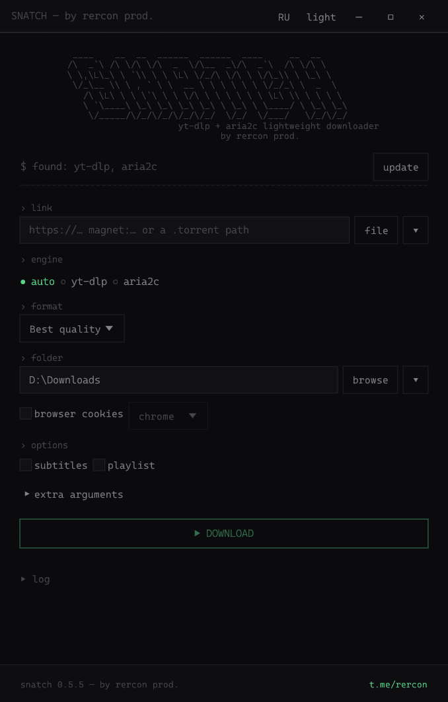
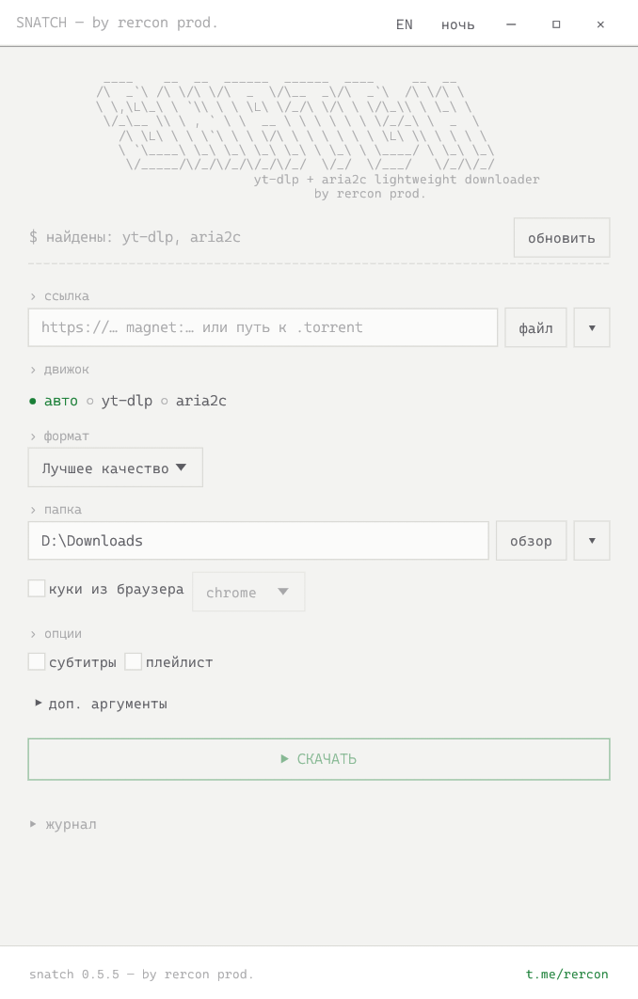
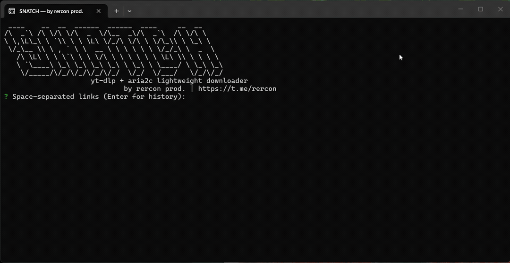

<p align="center">
  
</p>

<h1 align="center">SNATCH</h1>

<p align="center">
  <strong>Tiny footprint. Rich features. Fast downloads.<br>A lightweight, hardened Windows downloader with automatic engine selection.</strong>
</p>

<p align="center"><strong>English</strong> · <a href="README.ru.md">Русский</a></p>

<p align="center">
  <a href="https://github.com/RERCON0/SNATCH/actions/workflows/ci.yml"></a>
  <a href="https://github.com/RERCON0/SNATCH/actions/workflows/security.yml"></a>
  <a href="https://github.com/RERCON0/SNATCH/releases/latest"></a>
  <a href="https://github.com/RERCON0/SNATCH/releases"></a>
  <a href="LICENSE"></a>
  <a href="https://t.me/rercon"></a>
</p>

<p align="center">
  <a href="https://github.com/RERCON0/SNATCH/releases/latest"><strong>Download for Windows</strong></a> ·
  <a href="#quick-start">Quick start</a> ·
  <a href="#release-signatures">Verify a release</a> ·
  <a href="docs/RELEASING.md">Release guide</a> ·
  <a href="SECURITY.md">Security</a>
</p>

<table>
  <tr>
    <th>Dark · English</th>
    <th>Light · Русский</th>
  </tr>
  <tr>
    <td width="50%"><a href="docs/screenshot.png"></a></td>
    <td width="50%"><a href="docs/screenshot-light-ru.png"></a></td>
  </tr>
</table>

<p align="center">
  <a href="docs/cli-demo.gif"></a><br>
  <sub>English CLI · paste a link → confirm choices → download</sub>
</p>


SNATCH is built to get you the material you want — video, audio, a file or a
torrent — with a tiny footprint, plenty of features and few steps between a
link and a running download.

## Why SNATCH

- **Tiny by design.** Lightweight, portable Rust executables with a native GUI
  and CLI, without Electron. Download tools are installed separately when needed.
- **Hardened throughout.** Verified tool downloads, bounded archive extraction,
  input checks, protection against unsafe paths and safeguards against resuming
  another download's files. Security is part of the download workflow.
- **Automatic engine selection.** Paste a link: SNATCH recognizes its type and
  picks or recommends yt-dlp for video pages and streams, or aria2c for direct
  files, torrents and magnets. You can override the choice.
- **Quick repeat downloads, including in the CLI.** Recent links and folders
  stay at hand. Accept the suggested engine, format and folder with **Enter**;
  change only the settings you need.
- **Rich features in a small package.** Quality selection, original audio or
  mp3, subtitles, playlists, parallel downloads, resume and torrent file selection.

> [!TIP]
> **From a link to a download in seconds.** Install tools once and choose a folder.
> For your next download, paste the link and confirm the offered choices with
> **Enter**. The interactive CLI guides the whole flow; downloader commands
> are handled by SNATCH.

> [!NOTE]
> The `snatch` CLI and `snatch-app` GUI share the same engine and settings.
> Switch between them and keep your recent links, folders and language preference.

## Features

- **Automatic engine selection** for videos, direct links and torrents.
- **Quality options:** video up to 2160p, mp3 or original audio, subtitles and playlists.
- **Safe resume:** interrupted downloads are checked against their original source.
- **Concurrent CLI downloads:** three by default, configurable with `-j 1..16`.
- **History:** the last 15 links and folders; dark and light GUI themes.
- **Built-in tool installer:** yt-dlp, aria2c, ffmpeg and Deno.
- **English and Russian:** switch languages in the GUI or with `--lang en|ru`.

## CLI or GUI

| | `snatch` | `snatch-app` |
|---|---|---|
| Interface | Interactive terminal | Native window |
| Unattended use | `-y` and arguments | Fields and buttons |
| Folder selection | Menu, drives or `-o` | Built-in folder browser |
| Progress | Per-job indicators | Progress bars and log |
| Language | `--lang en` / `--lang ru` | EN / RU button in the title bar |

## Installation

Download the Windows x64 ZIP from [Releases](https://github.com/RERCON0/SNATCH/releases),
extract it and run `snatch-app.exe` or `snatch.exe`. SNATCH itself needs no installation.
You can add the CLI folder to `PATH`.

> [!IMPORTANT]
> The executables do not currently have Authenticode signatures, so Windows
> SmartScreen may show **“Windows protected your PC.”** If you downloaded the archive
> from [official Releases](https://github.com/RERCON0/SNATCH/releases) and trust it,
> choose **More info → Run anyway**. The Ed25519 package signature does not remove
> this warning. If the run option is unavailable, do not change security policies to install it.

> [!TIP]
> Install tools with the GUI's **install tools / update** button or
> `snatch --install-tools`. They are stored in `%LOCALAPPDATA%\snatch\bin`;
> no `PATH` changes are needed.

ffmpeg enables video/audio merging, mp3 conversion and subtitle processing.
Deno handles YouTube JavaScript challenges. Both are included in tool installation.

<details>
<summary>Manual installation with WinGet</summary>

```powershell
winget install yt-dlp.yt-dlp
winget install aria2.aria2
winget install Gyan.FFmpeg
winget install DenoLand.Deno
```

SNATCH looks in its managed tools folder, then in `PATH` and WinGet folders.
Use `SNATCH_YT_DLP` and `SNATCH_ARIA2C` for custom paths —
see [external tool paths](docs/CLI.md#external-tool-paths).

</details>

## Quick start

In the GUI, paste a link or drop a local `.torrent` file, choose the engine,
format and folder, then click **DOWNLOAD**. The log opens in a separate window.

Launch the CLI with no arguments or pass a link:

```powershell
snatch
snatch "https://youtube.com/watch?v=..."
snatch "magnet:?xt=urn:btih:..."
```

Separate multiple links with spaces. Quote torrent paths that contain spaces.
An empty link prompt opens history. For multiple links, choose the folder once,
then select an engine and format for each link.

> [!TIP]
> The CLI folder browser lists **Drive C:\**, **Drive D:\** and other connected drives.
> Choose a drive, then a folder, or pass the path directly: `-o "D:\Downloads"`.

Unattended downloads:

```powershell
snatch "https://host/file.zip" -y -o "D:\Downloads"
snatch "https://youtube.com/watch?v=..." -y -o "D:\Video" -f 1080p
snatch "https://youtube.com/watch?v=..." -y -o "D:\Music" -f audio
snatch "magnet:?xt=urn:btih:..." "https://host/file.zip" -y -o "D:\Downloads" -j 2
```

### Language

English is the default. Use the **EN / RU** button next to the theme button in the title bar or run:

```powershell
snatch --lang ru
snatch --lang en
snatch --lang ru --help
```

The choice is saved for subsequent CLI and GUI launches. `--lang ru --help`
shows Russian help without changing the saved preference. Download formats,
subtitle languages and filenames are independent of the interface language.

| Argument | Purpose |
|---|---|
| `--lang en|ru` | Select and remember the interface language |
| `-o, --output` | Download folder |
| `-j, --jobs` | Concurrent jobs: 1–16 |
| `-e, --engine` | Choose an engine manually |
| `-f, --format` | `best`, 2160p–480p, `audio` (mp3), `audio-src` |
| `--subs`, `--playlist` | Subtitles or the full playlist |
| `--cookies-from-browser` | Browser session for sign-in |
| `--no-continue` | Restart an interrupted download from scratch |
| `--clear-history` | Clear recent links and folders |

See the [CLI reference](docs/CLI.md) or `snatch --help` for all options.

### Engine selection

| Link | Engine |
|---|---|
| `magnet:…`, local `.torrent` and `.metalink` files | aria2c |
| Direct file links: `.mp4`, `.zip`, `.iso`, `.pdf` and others | aria2c |
| Video pages, playlists and streams | yt-dlp |

When yt-dlp handles a direct link, it may use aria2c as an external downloader.
Resume is disabled on that path to protect existing files.

### YouTube sign-in

Sign in to YouTube in your browser, then pass its session:

```powershell
snatch "https://youtube.com/watch?v=..." -y -o "D:\Video" --cookies-from-browser chrome
```

After a sign-in error, the interactive CLI offers to retry with browser cookies;
the GUI shows a retry button. You can specify a profile, such as `chrome:Profile 1`.

> [!IMPORTANT]
> Cookies grant access to your account. SNATCH passes them to local yt-dlp;
> use browser sessions only on a trusted computer. If the browser locks its
> cookies database, close it and retry.

### Resume and existing files

SNATCH resumes its own interrupted downloads and protects unrelated files with matching names.

> [!CAUTION]
> If torrent files already exist but their `.aria2` state is missing, choose an
> empty folder. To preserve downloaded pieces, make a copy and verify them with
> a torrent client before allowing any overwrites.

## Settings and security

Windows settings are stored in `%LOCALAPPDATA%\snatch\config.json`.
History is limited to 15 entries; `snatch --clear-history` clears it without
removing your other preferences.

- Tool installation checks checksums, download sizes and extracted executables;
  archive paths and extraction sizes are constrained.
- Links and local paths are checked; UNC paths are rejected before they can
  expose Windows credentials to a remote host.
- Downloaders are launched directly, without a shell. Additional aria2c arguments
  are restricted to allowed options.
- Resume markers bind partial direct downloads to their original URL; file locks
  protect concurrent downloads and settings writes.
- History removes username/password information from URL authorities and terminal menus filter control and
  invisible formatting characters from untrusted names.

See [SECURITY.md](SECURITY.md) for the threat model, trust boundaries and remaining
limitations. The GUI and CLI use the same guarded download engine.

## Release signatures

Release ZIPs include both executables, licenses and an **Ed25519-signed manifest**.
The manifest ties file hashes to the exact Git commit, source tree, Cargo.lock and
compiler version. Verification runs before extraction and rejects altered, extra
or duplicate files. Legacy unsigned archives cannot be verified this way.

> [!IMPORTANT]
> Obtain the trusted key from the repository, not just from the ZIP being checked.

Get the [public key](release/public-key.pem) and [verification script](scripts/release.py)
from the repository. From the checkout root, run:

```powershell
python scripts/release.py verify .\snatch-windows-x64.zip
```

Verification requires **Python 3.13+** and **OpenSSL 3** (included in Git for Windows).
The embedded key is compared with the external trusted key. Replacing the key
inside the archive cannot make a forged signature valid.

Public key SHA-256 fingerprint (DER SubjectPublicKeyInfo):

```text
22f55367a7a9bf635237c2da1e50e4c89338733d7fea5ab616615d75fc620afc
```

This signature covers the release package; it is not an Authenticode signature.
See the [release guide](docs/RELEASING.md) for details.

## CI checks

| Check | Coverage |
|---|---|
| [CI](https://github.com/RERCON0/SNATCH/actions/workflows/ci.yml) | Windows and Linux compilation, formatting, warning-free Clippy, CLI/GUI/engine tests and ZIP tamper rejection |
| Windows release build | x64 architecture, CLI/GUI subsystems, ASLR, DEP and no VC++ Redistributable dependency |
| [Security](https://github.com/RERCON0/SNATCH/actions/workflows/security.yml) | Daily RustSec checks; vulnerabilities, unsound and yanked versions fail checks; secret scanning covers Git history |
| [Dependency watch](https://github.com/RERCON0/SNATCH/actions/workflows/dependency-watch.yml) | Maintainer review reminders for new stable Rust and changes to the pinned aria2 release |
| [Dependabot](.github/dependabot.yml) | Weekly Cargo.lock and pinned Actions update proposals |

All Actions use full commit pins. CI uploads **unsigned candidates** for diagnostics.
Release signing is separate; the private key stays outside Git and CI runners.
Unmaintained dependency warnings remain visible; see the `ttf-parser` status and
upgrade plan in [SECURITY.md](SECURITY.md). Published binaries target **Windows x64**.

## Development

Install Rust through Rustup and MSVC Build Tools for Windows.
The compiler version is pinned in `rust-toolchain.toml`.

```powershell
cargo build --locked
cargo run --locked --bin snatch
cargo run --locked --bin snatch-app
cargo fmt --all -- --check
cargo clippy --locked --all-targets -- -D warnings
cargo test --locked --all-targets
```

Build executables with `cargo build --locked --release --bins`.
Follow the [release guide](docs/RELEASING.md) to create a signed package.

> [!NOTE]
> `cargo run` rebuilds changed sources before launching. Update a separate copy
> installed on `PATH` with `cargo install --path . --bins --force --locked`.

## License

[GNU GPL v3.0 or later](LICENSE). Bundled font:
[Cascadia Mono / SIL OFL notice](fonts/OFL-notice.txt).

[Author's Telegram](https://t.me/rercon) · [Source](https://github.com/RERCON0/SNATCH)
